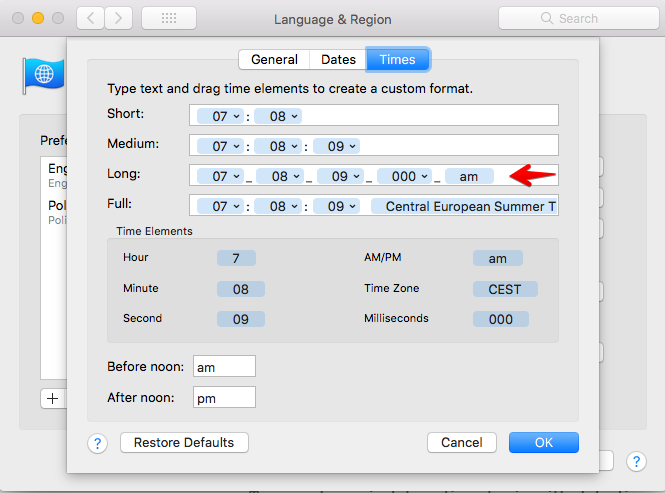

Sometimes, during developing a feature, I need to create a user, using the UI. As it may get annoying to come up with new email addresses, I've checked if Alfred has the ability of generating random data, via its snippets. It does not (at least at the time of writing). However! It has something called `Dynamic Content`, allowing you to expand some variables provided by them. And as they provide [Date and Time expansion](https://www.alfredapp.com/help/features/clipboard/dynamic-placeholders/#date-time), we can essentially get pseudo unique data.

On my mac, `{time:long}`, expands to `12:30:00`. This is can be modified, in `Lenguage & Region`. Let's make sure we use only characters valid in email addresses:




With this we can create a snippet

```
{time:long}@sample.co
```

And it will generate

<video width="100%" height="120" autoplay loop>
  <source src="../assets/images/2018-03-15/alfred_email_generator.mov">
</video>
